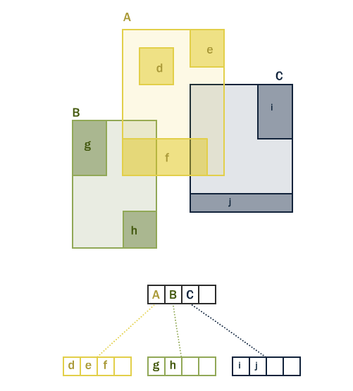

# Geospatial Query Optimization for Mapping Applications

---

### Objective

This portfolio focuses on optimizing geospatial queries to efficiently retrieve point data in a mapping application that predicts plastic locations. The goal is to find and display relevant data within user-defined viewports (bounding boxes) quickly and effectively.

---

### Challenges

- Managing and querying large datasets of geospatial plastic predictions.
- Ensuring the application remains performant and responsive even as users change their viewport.

---

### Basic Algorithm

Initially, I considered a simple linear search through an unsorted list of points within the dataset. This method is easy and straightforward but inefficient for large datasets.

---

### R-tree Index Algorithm

To address the inefficiencies of the basic approach, the R-tree, a spatial data structure, is introduced. R-trees are ideal for indexing large amounts of spatial data and support efficient querying of multi-dimensional information. By organizing points into a hierarchical structure, R-trees can significantly reduce the number of points that need to be checked against a given query bounding box.

---

## Detailed Algorithmic Analysis with Python Code Examples

---

### Basic Linear Search Algorithm

**Procedure**: Check each point against the bounding box to determine if it should be displayed.

---

**Python Code Example**:

```python
def linear_search(points, bbox):
    results = []
    for point in points:
        if bbox[0] <= point[0] <= bbox[2] and bbox[1] <= point[1] <= bbox[3]:
            results.append(point)
    return results
```

---

**Time Complexity Analysis:**

Every point n in the dataset must be checked individually against the query bounding box. This results in a linear time complexity of O(n) for best, average, and worst-case scenarios.

---

### R-tree Indexing Algorithm

Procedure: Utilize the hierarchical structure of R-trees to avoid unnecessary checks by excluding entire groups of points that do not intersect with the bounding box.
This implementation of the R-tree includes the following key components:

- **Node**: Represents a node in the R-tree, containing a list of points, children nodes, and a bounding box.
- **Splitting logic**: based on the R\*-tree algorithm. This splitting logic evaluates the best split based on the overlap and area of the resulting nodes for each axis. This results in a more balanced tree and better query performance(S. Brakatsoulas)
- **RTree**: The main class that manages the tree structure and provides methods for inserting points and querying points within a bounding box.

_Note that this implementation only works for 2D data. It also only supports inserting points and querying points within a bounding box_

---

**Python Code Example**: [r_tree.py](../src/r_tree.py)

---

## R-tree Hierarchical Structure



---

## Concrete Example

I've included a interactive map that visualizes the results of a query and hierarchical bounding box structure of the R-tree in a real-world scenario. The map is generated using the `folium` library.
[See the map here](plots/rtree_map_optimized.html)

---

**Time Complexity Analysis:**

**Insertion (`insert` method)**

- **Process**: The insertion process involves finding the appropriate leaf node and updating or splitting the node if necessary.

---

- **Complexity**:

  - **Best Case**: The point to be inserted falls into a node that has available capacity (< `max_childen`), thereby avoiding a split. If the point inserted is a leaf (the first point inserted into the tree) the time complexity is O(1). However, for all consecutive insertions this involves traversing from the root to the appropriate leaf node, which takes logarithmic time relative to the number of elements (n) in the tree (O(log⁡ n)). Logarithmic and not linear time because with each iteration the number of potential nodes to traverse decreases exponentially.

---

- **Average Case**: Similar to the best case but includes occasional splits as nodes reach maximum capacity. While insertion generally requires traversing down to a leaf node and possibly updating bounds upwards, the average complexity remains logarithmic. Most insertions are straightforward, but occasional node splits involve more computational overhead, primarily sorting and selecting the best split. Still, these operations are constrained by the maximum number of children per node, which is 10 in my implementation.

---

- **Worst Case**: The inserted point requires a split at every level of the tree, affecting the tree structure significantly. This brings the time complexity closer to O(n) because each level of the tree must be traversed and potentially split. This is unlikely if the split logic keeps the tree balanced.

The `max_children` has a impact on the complexity of the insertion operation. The higher the `max_children`, the more children a node can have before it is split, which can reduce the number of splits required during insertion. However, a higher `max_children` can also lead to more overlap between nodes, which can increase the complexity of the query operation.

---

**Query (`query` method)**

- **Process**: The query operation checks each node starting from the root to see if the query box intersects with the node’s bounding box and recursively checks its children if it does.

**Best Case**: If the query region directly targets a sparsely populated or well-separated part of the space that few nodes cover, the complexity could be as low as O(log⁡ n), because it quickly narrows down to a specific area.

**Average Case**: For well-distributed data in a balanced tree, the complexity should ideally be O(log⁡ n)because each level of the tree exponentially decreases the number of potential intersecting nodes.

---

- **Worst Case**: If the query intersects with many or all bounding boxes (e.g., a very large query box in a densely populated tree), or if the tree is poorly balanced with lots of overlap, the complexity could go up to O(n). This would occur if nearly every node needs to be checked.

---

## References

- Brakatsoulas, S., Pfoser, D., & Theodoridis, Y. (2002). Revisiting R-tree construction principles. Computer Technology Institute.
- Guttman, A. (1984). R-trees: A dynamic index structure for spatial searching. University of California, Berkeley, Computer Science Division.

---
